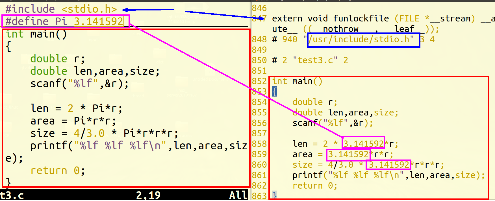
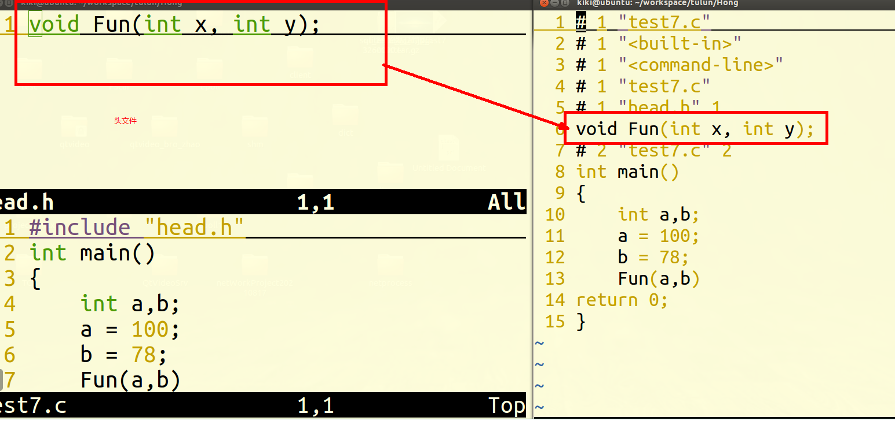

# C语言编译链接过程

#### 1. 过程

​ 源文件( \*.c源文件/ \*.h头文件 )

​ 预处理( \*.i预编译文件 ) gcc -E main.c -o main.i

​ 编 译( \*.s汇编文件 )(从上到下) gcc -S main.i -o main.s

​ 汇 编( \*.o/ \*.obj二进制目标文件 ) gcc -c main.s -o main.o

​ 链 接( \*.exe可执行文件 ) gcc -o main.o -o main

​ 执 行 --> 进程(从main函数开始)

#### 2. 预处理

​ 概念：C语言源代码编译成可执行程序的第一阶段，在该阶段中主要的功能实现了宏替换，以及头文件展开；此外还可能会包括条件编译

​ 语法:预处理指令 表达式

**1. 宏替换(宏展开)**

预处理过程中,将变量,数据或表达式用容易理解的形式进行替换

\#define 宏名 要替换的内容

为了提高程序阅读性,增强编码效率

特点:不做类型检查,仅仅是字符串的替换

**2. 头文件展开**

将头文件内容替换进当前程序

